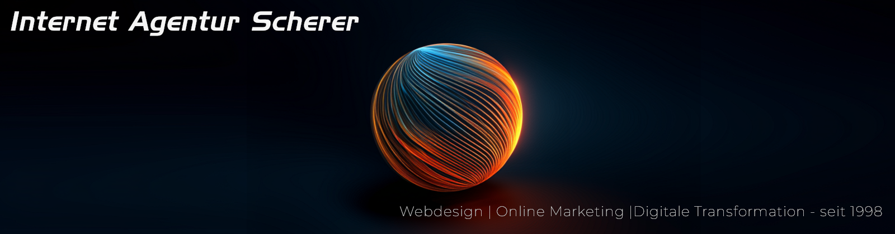

# Internet Agentur Scherer

**Webdesign, Online-Marketing & digitale Transformation – mit messbarer Performance und viel Praxis.**  
Aus Dachau für Bayern und weit darüber hinaus. Wir begleiten KMU vom ersten Konzept bis zum Launch – und kontinuierlich weiter.

## Wofür wir stehen
Pfiffige Konzepte, kreative Lösungen und solide Umsetzung – mit Engineering-Fokus und Expertise seit 1998.

## Open Source & Tech
- **Webentwicklung:** client- und serverseitig, auf gängigen CMS
- **Performance:** PageSpeed/Core Web Vitals, k6-Lasttests, Caching/Redis
- **Sicherheit:** Zugangsschutz, Single-Login-Guard, Härtung & Monitoring
- **DevOps/SRE (inkl. SRE-Mindset):** CI/CD, Infrastructure as Code (Ansible/Terraform), GitHub Actions
- **Cloud:** AWS & GCP (EC2/S3/CloudFront | GCE/Cloud Storage)
- **KI/AI:** Content-Workflows & Automationen, pragmatisch eingesetzt

In diesem Org-Account veröffentlichen wir Best Practices, Tools & Beispiele aus echten Projekten.

## Kontakt
- 🌐 **Website:** https://www.internetagentur-scherer.de  
- 📩 **Anfrage:** bitte kurz über das Kontaktformular – wir melden uns zeitnah.

> *„Digitalisierung ist kein einmaliges Projekt, sondern kontinuierliche Transformation.“*  
Wir bewerten Trends & Hypes realistisch – Cloud & KI dort, wo sie Ihren Zielen dienen.
